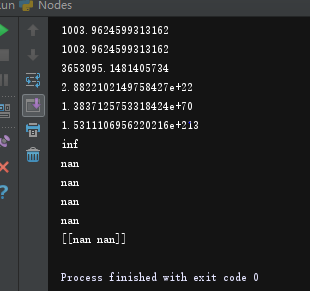

# 计算图

### Nodes

在深度学习框架里底层实现`Back-propagation`算法是通过构建计算图完成，普通的一元运算和二元运算可以简单地通过二叉树实现，

```python
class Node():
    def __init__(self):
        self.last_right = None
        self.last_left = None
        self.next = None
        self.value = None
        self.grad = None
        self.sub_grad = None
        self.require_grad = True
```

二叉树的一个节点的属性如上，我们可以通过继承上面这个基类去设计更多类型的节点，如变量节点`(Variable)`，常数节点`(Constant)`，操作符节点`(Operator)`，输入节点`Input`等等。

每个节点设计有如下方法：

```python
def output_val(self):
    pass

def compute_gradient(self):
    pass

def update_param(self):
    pass
```

几种node的定义如下：

```python
class Input(Node):
    def __init__(self, X):
        super().__init__()
        self.value = X
        # self.require_grad = True

    def output_val(self):

        return self.value

    def compute_gradient(self):         ## compute gradient 是计算下面两个连接的节点，因此非operator的comput_gradient无作用
        pass

class Variable(Node):
    def __init__(self, X):
        super().__init__()
        # self.require_grad = True
        self.value = X
        self.need_update = True

    def output_val(self):
        return self.value

    def compute_gradient(self):         ## compute gradient 是计算下面两个连接的节点，因此非operator的comput_gradient无作用
        pass

class Const(Node):
    def __init__(self, X):
        super().__init__()
        # self.require_grad = True
        self.require_grad = False
        self.value = X
    def output_val(self):
        return self.value

    def compute_gradient(self):         ## compute gradient 是计算下面两个连接的节点，因此非operator的comput_gradient无作用
        pass


class Add(Node):
    def __init__(self, left_node, right_node):
        super().__init__()
        self.last_left = left_node
        self.last_right = right_node
        left_node.next = self
        right_node.next = self

    def output_val(self):
        if self.last_left.value.shape == self.last_right.value.shape:
            self.value = self.last_left.value + self.last_right.value
        elif self.last_left.value.shape[1] == self.last_right.value.shape[1]:      # 加bias的情况
            temp_val = np.ones(self.last_left.value.shape)
            for i in range(self.last_left.value.shape[0]):
                temp_val[i,:] = self.last_right.value[0,:]
            self.value = temp_val + self.last_left.value

    def compute_gradient(self):
        self.last_left.sub_grad = np.ones(self.last_left.value.shape)    ## 以左边节点大小为准
        self.last_right.sub_grad = np.ones(self.last_left.value.shape)
```

`Variable`节点的compute gradient函数没有设计因为这里我默认方式是变量节点是没有入度的，只有operator才有入度。可以看到Add节点的输出方式，如果输入节点shape都一样直接相加，如果不一样则需要复制左边节点使得其形状与右边一致（因为默认b会在左边出现）。

### Dimension Analysis

在这里，我设计的求导方式是基于标量对向量或矩阵进行反向传播，因此`Backward`函数要作用在最后的输出节点（标量）才有意义。Back propagation的详尽运行机制在：

[1]: https://aistudio.baidu.com/aistudio/education/lessonvideo/869145

整个计算图的建立，前向传播计算输出值以及后向传播计算输出值计算梯度如下图所示：


目前求sub_grad的方法很简单，如果是乘法则返回与之相乘的矩阵的转置，如果是加减，则返回与之shape一样的全1矩阵.如上图Add的sub_grad所示。通过`DFS` 深度优先遍历进行前向传播，然后`BFS`层序遍历后向计算梯度：

```python
def Forward(root):
    '''
    :param root: the last operater
    :return: output value 
    '''
    if root == None:
        return root

    Forward(root.last_left)
    Forward(root.last_right)
    root.output_val()

    return root

# breadth-first search
def Backprop(root):
    '''
    :param root:
    :return: need to be updated nodes
    '''
    if root == None or (root.last_left == None and root.last_right == None):
        return

    param = []  # record the nodes that need to be updated

    Q = Queue(10, root)
    Q.enqueue(root)

    while (Q.isEmpty() == False and not Q.isFull()):
        size = Q.queueSize()
        for i in range(size):
            temp = Q.dequeue()
            if temp.grad is None:  # if is the first node
                temp.grad = np.ones(temp.value.shape)
                temp.compute_gradient()
                if temp.need_update == True:
                    param.append(temp)
                if temp.last_left != None and temp.last_left.require_grad:
                    temp.last_left.grad = temp.last_left.sub_grad
                    Q.enqueue(temp.last_left)
                if temp.last_right != None and temp.last_right.require_grad:
                    temp.last_right.grad = temp.last_right.sub_grad
                    Q.enqueue(temp.last_right)
            else:
                temp.compute_gradient()
                if temp.need_update == True:
                    param.append(temp)
                if temp.last_left != None and temp.last_left.require_grad:
                    temp.last_left.grad = chain_rule(temp.grad, temp.last_left.sub_grad, 'l')
                    Q.enqueue(temp.last_left)
                if temp.last_right != None and temp.last_right.require_grad:
                    temp.last_right.grad = chain_rule(temp.grad, temp.last_right.sub_grad, 'r')
                    Q.enqueue(temp.last_right)

    return param

```


### Dense层的设计

本来打算把全连接层直接设计为一个节点，输入节点加上一列全为1，权重矩阵加上一行b，这样可以减少整个二叉树的大小，遍历起来速度应该也会快些（空间换时间）。`weight_bias`储存weight和bias的值，`self.sub_grad`储存的是当前输入的gradient所以是weight的转置，省略掉了bias的gradient。 后面操作发现`Dense`节点的属性如果只有sub_grad和grad无法通过简单的反向传播计算当前节点的梯度，如果这样设计不够general，例如本来当前节点compute gradient可以把下个节点的sub gradient算出来，但Dense层算出来下一层sub gradient和这一层的gradient通过chain_rule相乘得到的不是下一层的gradient，因为Dense层算出来的sub gradient只是 $\frac{\partial L}{\partial A}$ 需要多一个属性储存 $\frac{\partial A}{\partial w}$ ,还有一个属性储存 $\frac{\partial L}{\partial w}$ ，这样结构上就和普通运算的节点不一样，所以没那么general。所以后面采取的方法还是直接设计一个Dense函数，直接用原来的节点搭起来一个全连接层。

由于这里设计的bias和weight是事先定义好shape，而需要根据前面的传入值定义shape，所以前面节点需要值，所以在整个网络初始化时需要输入一个batch_size的数据 （此处不够简洁）。

```python
x = Input(x_batch)   #事先输入一个batch
l2 = Dense(x, 6)
# l2 = Sigmoid(l2)
l3 = Dense(l2, 4)
# l3 = Sigmoid(l3)
l4 = Dense(l3, 4)
# l4 = Sigmoid(l4)
l5 = Dense(l4, 3)
# l5 = Sigmoid(l5)

y = Const(y_batch)   #事先输入一个batch
```

### Batch training

这里设计的计算图可输入批量的训练数据，因此在bias节点处有特殊处理。以上图为例子，输入为2 * 3，两个instance，但是bias的shape是1，而b的gradient的shape是2 * 1，所以更新b时是如下操作，把计算出的b的梯度求和再更新：

```python
else:
     self.param[i].value = self.param[i].value - self.lr * sum(self.param[i].grad)  # sum: column-wise
```

### Normalization

一定要做normalization, 因为一般参数的初始话是非常小的数，若不做归一化，输出和label的相差太远，导致gradient的值非常的大，整个算法也收敛不了，一直发散。



#### Batch Normalization

在深度网络中想要成功train起整个网络是一件非常困难的事情，为了让训练能够更加平滑,解决`internal covariate shift`, 和gradient vanishing exploding的问题，2015。。。提出`BN`技术，一般用在激活函数之前，使用BN一定要用批训练，输入神经网络样本要大于等于2.

[2]: https://www.cnblogs.com/shine-lee/p/11989612.html	"Batch Normalization"

目前这一层应该有些小问题，在浅层网络用的时候，测试阶段的输出会与原来很大不同，深层一点反而好，不知道是`BN`层的特性还是我编写的错误。

### Forward（）

训练时Forward的参数是cost，测试时是神经网络最后一层的地址

### Zero_grad

需要加多个Zerograd函数对计算图里的梯度进行清除，那么下次继续用不同`batch size`数据训练才不会出错。不过用这种方法的情况也比较少，除非是在notebook运行环境里，而考虑到MQL程序一次性运行完，所以应该没必要写这个函数。