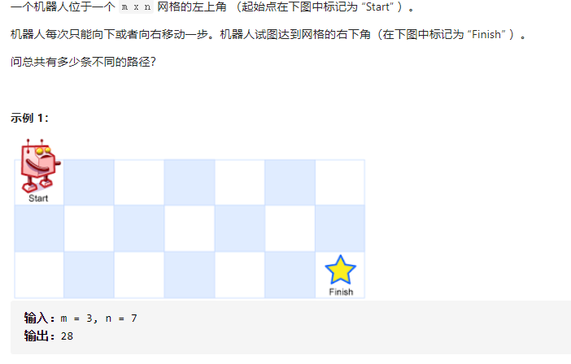

# 动态规划

### 股票买卖问题（含手续费）

动态规划：动态方程组+表格记录

```C
int maxProfit(int* prices, int pricesSize, int fee){
    int n = pricesSize;
    int dp[2][n];
    dp[0][0] = 0; dp[1][0] = -prices[0];
    for(int i = 1;i<=n-1;i++)
    {
        dp[0][i] = fmax(dp[0][i-1], dp[1][i - 1] + prices[i] - fee );
        dp[1][i] = fmax(dp[0][i-1] - prices[i], dp[1][i-1]);
    }

    //return fmax(dp[1][n-1],dp[0][n-1]);
    return dp[0][n-1];
}
```

一共有4种状态，`dp[1][i - 1] + prices[i] - fee`代表前一天持有股票今天卖出得到的总收益，`dp[0][i-1] - prices[i]`代表昨天没有持有今天买入的收益，买入所以减去今天价格，其余两种情况均为维持上一天的状态，因此受益就是上一天得到的收益。注释部分：不需要取最后一日两种操作最大值，因为最后一天的操作只可能是卖或继续持有，这两个状态已经在 `dp[0][i]` 里包含了。

|      |   day1    |    day2    | day3 | day4 | day5 |
| :--: | :-------: | :--------: | :--: | :--: | :--: |
|  0   |     0     | two choice |      |      |      |
|  1   | -price[0] | two choice |      |      |      |

### 所有路径




有三种解法，深搜，动规，和数论。

#### 深搜 

此时问题就可以转化为求二叉树叶子节点的个数，代码如下：

```C++
class Solution {
private:
    int dfs(int i, int j, int m, int n) {
        if (i > m || j > n) return 0; // 越界了
        if (i == m && j == n) return 1; // 找到一种方法，相当于找到了叶子节点
        return dfs(i + 1, j, m, n) + dfs(i, j + 1, m, n);
    }
public:
    int uniquePaths(int m, int n) {
        return dfs(1, 1, m, n);
    }
};
```

来分析一下时间复杂度，这个深搜的算法，其实就是要遍历整个二叉树。

这颗树的深度其实就是m+n-1（深度按从1开始计算）。

那二叉树的节点个数就是 2^(m + n - 1) - 1。（假设是完全二叉树）可以理解深搜的算法就是遍历了整个满二叉树（其实没有遍历整个满二叉树，只是近似而已）

所以上面深搜代码的时间复杂度为O(2^(m + n - 1) - 1)，可以看出，这是指数级别的时间复杂度，是非常大的。

#### 动规

```C++
class Solution {
public:
    int uniquePaths(int m, int n) {
        int dp[m][n];
        
        for (int i = 0; i < m; i++){
            for (int j = 0; j < n; j++){
                if (i > 0 && j >0)
                    dp[i][j] = dp[i - 1][j] + dp[i][j - 1];
                else if(i == 0 && j == 0){
                    dp[i][j] = 1;
                }
                else if(i == 0 && j != 0){
                    dp[i][j] = dp[i][j - 1];
                }
                else if(i != 0 && j == 0){
                    dp[i][j] = dp[i - 1][j];
                }
            }
        }
        return dp[m - 1][n - 1];
    }
};
```

#### 数论

在这m + n - 2 步中，一定有 m - 1 步是要向下走的，不用管什么时候向下走。

那么有几种走法呢？ 可以转化为，给你m + n - 2个不同的数，随便取m - 1个数，有几种取法。

那么这就是一个组合问题了。

那么答案，如图所示：

[](https://camo.githubusercontent.com/5d78d86907a2700cf7d8e0ba1c3d4a69629f44d31f285855bc8ef1ae1fe56618/68747470733a2f2f696d672d626c6f672e6373646e696d672e636e2f32303230313230393131333732353332342e706e67)

代码：需要在计算分子的时候，不断除以分母（约分），代码如下：

```C
class Solution {
public:
    int uniquePaths(int m, int n, int array) {
        long long numerator = 1; // 分子
        int denominator = m - 1; // 分母
        int count = m - 1;
        int t = m + n - 2;
        while (count--) {
            numerator *= (t--);
            while (denominator != 0 && numerator % denominator == 0) {
                numerator /= denominator;
                denominator--;
            }
        }
        return numerator;
    }
};
```

#### 字节一道面试题

二维数组，每一个元组内是一个整数，从左上角往右下角走，只能够向右或者向下，要求经过的数的和最少，空间复杂度为O(max(m, n))，其中m为行数，n为列数。

```c++
class Solution {
public:
	int sumInterger(int m, int n, int array[][]){
        int dp[n];
        dp[0] = array[0][0]; //assume the first interger is 1
        for (int j == 1; j < n; j++){
            dp[j] = dp[j - 1] + array[0][j];
        }
        for (int i == 1; i < m; i++){
            for (int j == 0; j < n; j++){
                if (j == 0) dp[j] = array[i][j] + dp[j];
                else {
                    dp[j] = min(dp[j - 1], dp[j]) + array[i][j];
                }
            }
        }
    }
    return dp[n - 1];
};
```

